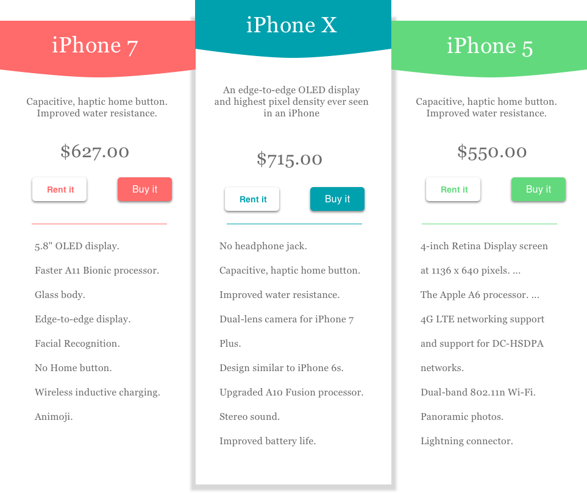
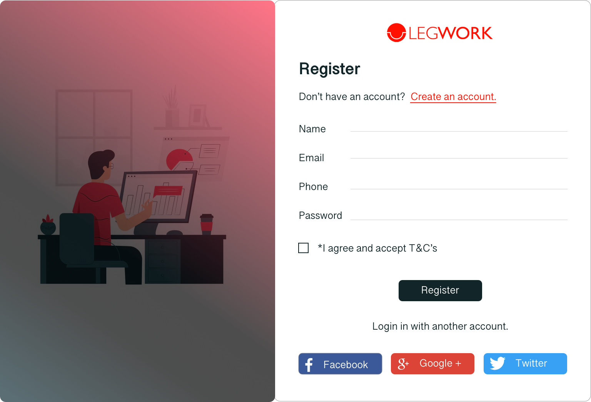

<!DOCTYPE html>
<html lang="en">
<head>
  <title>Sakina Das</title>
  <meta charset="utf-8">
  <meta name="viewport" content="width=device-width, initial-scale=1">
  
  <!-- <link rel="stylesheet" href="bootstrap.css" crossorigin="anonymous"> -->
  <link rel="stylesheet" href="css/custom-bootstrap.css">

  
  
  
  
  
</head>
<body>

  <nav class="navbar navbar-expand-lg navbar-light bg-dark">
    <!-- <a class="navbar-brand" href="#">Navbar</a> -->
    <button class="navbar-toggler" type="button" data-toggle="collapse" data-target="#navbarNavDropdown" aria-controls="navbarNavDropdown" aria-expanded="false" aria-label="Toggle navigation">
      
    </button>
    

      <ul class="navbar-nav">
        <li class="nav-item active">
          <a class="nav-link" href="#">Home (current)</a>
        </li>
        <li class="nav-item">
          <a class="nav-link" href="#">About</a>
        </li>
        <li class="nav-item">
          <a class="nav-link" href="#">Contact</a>
        </li>
        <li class="nav-item dropdown">
          <a class="nav-link dropdown-toggle" href="#" id="navbarDropdownMenuLink" data-toggle="dropdown" aria-haspopup="true" aria-expanded="false">
            Projects
          </a>
          

            <a class="dropdown-item" href="#">Action</a>
            <a class="dropdown-item" href="#">Another action</a>
            <a class="dropdown-item" href="#">Something else here</a>
          

        </li>
        <li class="nav-item">
          <a class="nav-link" href="#">Download Resume</a>
        </li>
      </ul>
    

  </nav>

    

      <h1 class="mb-5">Hi, I am Sakina Das</h1>    
      <h5>a creative being from Seattle, WA</h5>  
      <h3 class="mb-5">UI-UX Designer & Frontend Developer.</h3>
      <!--  -->
      <!-- 

        

          <h5>What I CAN do...</h5>
          <ul class="text-left">
            <li>UI UX research</li>
            <li>Wireframing</li>
            <li>Prototyping</li>
            <li> Website design</li>
            <li> UI development</li>
            <li>Frontend testing</li>
            <li>Design enhancements</li>
          </ul>
        

        

        

            <h5>What I FOCUS on...</h5>
            <ul class="text-left">
              <li>UI design</li>
              <li>UI development</li>
              <li>HTML, CSS, JavaScript</li>
              <li> Bootstrap, SCSS</li>
            </ul>
          

      
 -->

    

  

    

  
    
    <h2 class="pt-4 pb-4 bg-dark">Some of my Work</h2 class="mb-3"> 
    

      

        
Some text..

        
        <button class="btn">View Project</button>
      

      
 
        
Some text..

        
        <a href="msftaem.html"><button class="btn">View Project</button></a>
      

      
 
        
Some text..

        
        <button class="btn"><a href="msftaem.html">View Project</a></button>
      

    

  
 
  
  
    
    

        
 
            
Some text..

            
            <button class="btn"><a href="legworkcase.html">View Project </a></button> 
        

      
 
        
Some text..

        
        <button class="btn">View Project</button> 
      

      
 
          
Some text..

          
          <button class="btn"><a href="legworkcase.html">View Project </a></button> 
        

    

  
  
  
  <footer class="container-fluid text-center">
    
Footer Text

  </footer>
  
</body>
</html>
